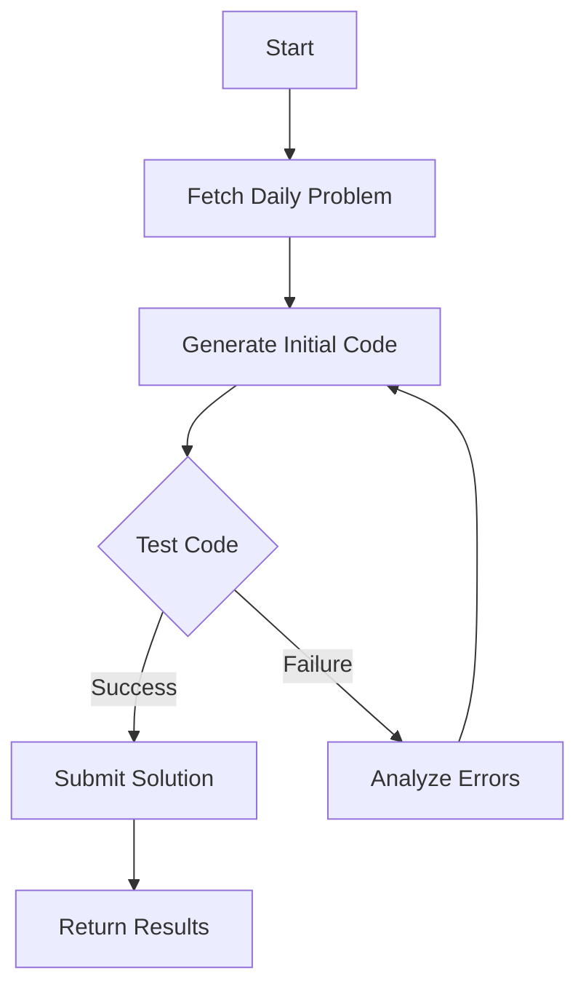

# LeetCode Solver Agent

[](https://www.python.org/)
[](https://opensource.org/licenses/MIT)

An AI-powered agent that automatically solves LeetCode daily problems using Selenium automation and LangGraph's state management.

## Features

- **Automated LeetCode Authentication**: Handles login using cookies or manual authentication
- **Daily Problem Fetching**: Retrieves the daily LeetCode challenge automatically
- **AI Code Generation**: Uses OpenAI's language model to generate Python solutions
- **Automated Testing**: Tests generated code against LeetCode's test cases
- **Smart Retry Mechanism**: Automatically fixes failed solutions using error feedback
- **Stateful Workflow Management**: Utilizes LangGraph for agentic workflow management
- **Web Interface**: Provides a Flask-based web endpoint to trigger the solving process

## Technologies

- **LangChain/LangGraph**: For AI agent workflow management
- **OpenAI**: Code generation and problem solving
- **Selenium**: Browser automation for LeetCode interaction
- **Flask**: Web server interface
- **undetected-chromedriver**: Stealthy browser automation

## Installation

1. **Clone the repository**:
   ```bash
   git clone https://github.com/your-username/Leetcode-Solver-Agent.git
   cd Leetcode-Solver-Agent
   ```

2. **Install dependencies**:
   ```bash
   pip install -r requirements.txt
   ```

3. **Set up environment variables**:
   Create a `.env` file with:
   ```ini
   LEETCODE_EMAIL=your_leetcode_email
   LEETCODE_PASSWORD=your_leetcode_password
   OPENAI_API_KEY=your_openai_api_key
   MODEL_NAME=gpt-4o-mini
   ENDPOINT=https://api.openai.com/v1
   ```

4. **Install Chrome**: Ensure Chrome is installed for Selenium automation

## Usage

1. **Start the Flask server**:
   ```bash
   python main.py
   ```

2. **Access the web endpoint**:
   - Base URL: http://localhost:5000
   - Trigger LeetCode solver: http://localhost:5000/leetcode

3. **View Solution**:
   The solved solution will be displayed in formatted markdown with:
   - Generated code
   - Test results
   - Submission status
   - Error debugging (if any)

## Workflow Overview



## Configuration

### Environment Variables
| Variable | Description |
|----------|-------------|
| `LEETCODE_EMAIL` | Your LeetCode account email |
| `LEETCODE_PASSWORD` | Your LeetCode account password |
| `OPENAI_API_KEY` | OpenAI API key |
| `MODEL_NAME` | OpenAI model version (default: gpt-3.5-turbo) |
| `ENDPOINT` | OpenAI API endpoint |

### File Structure
```
.
├── main.py              # Flask server and agent workflow
├── LeetCode.py          # LeetCode automation handler
├── requirements.txt     # Dependencies
├── .env                 # Environment template
└── templates/           # Flask templates
    └── solution.html    # Solution display template
```

## Key Components

### LeetCodeSessionManager
- Handles browser automation and authentication
- Manages cookie persistence
- Provides methods for:
  - Problem fetching
  - Code submission
  - Test execution
  - Language selection

### AI Solver Agent
1. **Problem Analysis**: Extracts problem statement and code template
2. **Code Generation**: Uses OpenAI to generate initial solution
3. **Testing Pipeline**:
   - Automatic test execution
   - Error analysis
   - Iterative code refinement
4. **Solution Submission**: Final code submission upon successful testing

## Troubleshooting

**Common Issues**:
- **Authentication Failures**:
  - Ensure correct LeetCode credentials
  - Complete CAPTCHA manually on first run
- **Browser Issues**:
  - Verify Chrome installation
  - Update ChromeDriver if needed
- **API Errors**:
  - Check OpenAI API key validity
  - Verify internet connection

## Contributing

Contributions are welcome! Please follow these steps:
1. Fork the repository
2. Create a feature branch (`git checkout -b feature/your-feature`)
3. Commit your changes (`git commit -am 'Add some feature'`)
4. Push to the branch (`git push origin feature/your-feature`)
5. Open a Pull Request

## License

This project is licensed under the MIT License - see the [LICENSE](LICENSE) file for details.

---

## Disclaimer

**Educational Purpose Only**: This project is intended strictly for educational and demonstration purposes to showcase:
- AI-powered problem solving capabilities
- Browser automation techniques
- Agentic workflow management

**Compliance Notice**: This tool is not intended to violate LeetCode's terms of service. Users are strongly advised to:
1. Review LeetCode's official terms of service ([https://leetcode.com/terms/](https://leetcode.com/terms/))
2. Understand their policies regarding automated solutions
3. Obtain explicit permission before using automation on LeetCode's platform

**Responsibility**: The developers disclaim all responsibility for:
- Any account restrictions imposed by LeetCode
- Consequences arising from misuse of this tool
- Violations of LeetCode's terms of service

**Ethical Use**: This project should not be used to:
- Gain unfair advantage in coding challenges
- Bypass platform security measures
- Automate solutions for competitive purposes
```
